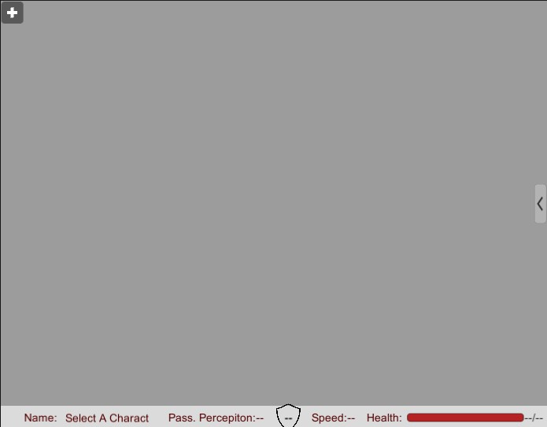
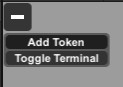
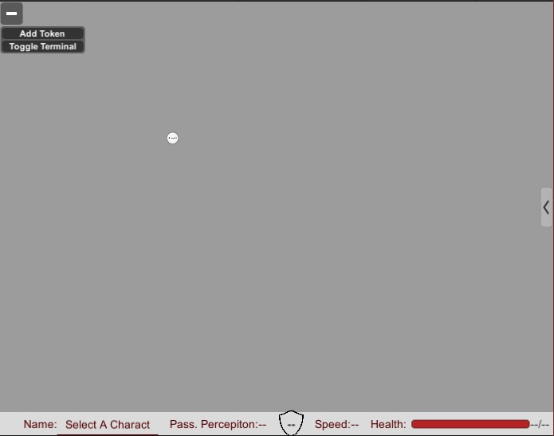
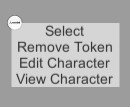
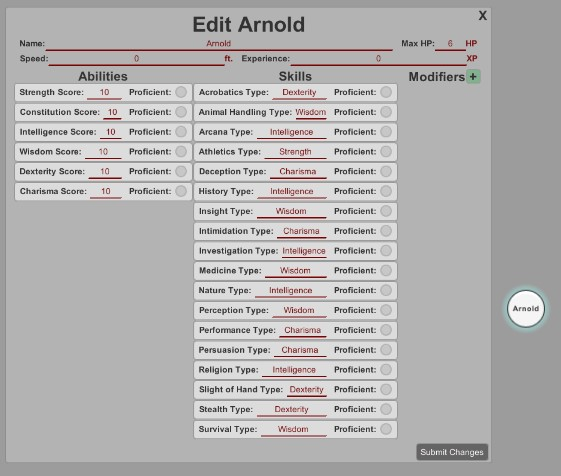
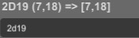
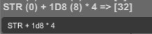

# Dragons and Dungeons _Virtual Tabletop_
##### This project uses [Unity 2019.4.12f1](https://unity.com/) and we recommend using this build of Unity to open this project

A colaborative project by:
- Brian Thompson
- Hunter Stokes
- Spencer Nettles
- Ethan Mangum

This project was originally our attempt to build a virtual tabletop for the roleplaying game [Dungeons and Dragons](https://dnd.wizards.com/), and some of the frame work for that is present. In this README, we will assume that you have a basic knowledge of how to run Unity, as there is better [for using Unity than can be provided here](https://unity.com/learn), and how Dungeons and Dragons work. 

# Features 

## 1. Adding Tokens to the Field
To add tokens to the field, press the (+) symbol in the top left corner. This will expand a small menu. Click "Add Token" and a token will apear. These tokens have colision with each other.

## 2. Token Funtionalities 
To access the funtionalities of the Token, right click it and the token menu will open. 

Click select to have the stats menu below update. A charater can be further edited by selecting edit charater. Each skill has the option to select whether or not the cahrater is profiecent. Proficency bonuses are handled in the background. Here you may change the name, adjust the speed, change the max health, and give the expereince.The experience will affect the level and profecency bonus.

You may make custom modifiers as well, granting them names and preset macros to your customization. 
Click submit changes when finished. 

Veiwing the charater will bring up the same menu as edit, except that changes cannot be made.

## 3. Terminal
The terminal has all our RegEx functions to help calculate things such as roles and mathmatics usd within Dungeons and Dragons.you may access it either throgh the (+) symbol and clicking "Toggle Terminal"
or clicking the (<) to the right of the GUI. Here you have access to our built in calculatior, where you may roll dice, add constants, and while you have a character selected, add ability score modifiers. 

Rolling dice is done through the phrase (x)D(y), where x is the number of dice and y is the number of sides on the dice (these must be whole number non-negative intergers).  See the example below.

You may also add, subtract, multiply or divide constants to dice roll, either by typing the interger, or typing out the associated basic stat (STR, DEX, CON, WIS, INT, CHA).

## 4. Expression Syntax
As demonstrated above, Expressions may be used to perfom mathematical operations using dice rolls, ability stats, variables, functions, and constants. All expressions are case insensitive!

### Expression Basics
For the most part, Expressions work just like a four function calculator with +, -, *, and / with a few exeptions. What happens when you want to work with individual dice rolls? This is where the twist comes in. All operations are done on lists of numbers rather than single numbers.

- Constant numbers can be single positive or negative integers, arrays of positive or negative integers, or arrays of entire nested expressions! Array elements that are expressions have their resulting list elements inserted into the list.  
Ex 1: 1 <- returns \[1]  
Ex 2: \[1,2] <- returns \[1,2]  
Ex 3: \[1 + 3, 2 * 4, \[1,2] + \[3,4]] <- returns \[4,8,4,6]
- \+ and - operators work element by element like you'd expect.  
i.e \[a,b,c] + \[d,e] = \[a+d, b+e, c+0]  
Ex: \[1,2] + \[3,4,5] <- returns \[4,6,5]
- \* and / operators work by "foiling." That is each element in the right hand list is multiplied by every element in the left hand list and results in a list with length left\*right.  
i.e. \[a,b,c] * \[d,e] = \[a\*d, b\*d, c\*d, a\*e, b\*e, c\*e]  
Ex: \[1,2,3] * \[1,2] <- returns \[1,2,3,2,4,6]
- <,>,=,<=,>=,AND, and OR are all boolean operations that compare all of the numbers in the left side to each of the numbers in the right. The resulting array is the same length as the right side of the operator and contains a count of how many numbers in the left side evaluated to true when compared to the right. A number is considered true if it is not 0.  
i.e. \[a,b,c] < \[d,e] = [a < d + b < d + c < d , a < e + b < e + c < e]  
Ex: \[5,6,3] > \[3,5] <- returns \[2,1] <- 2 numbers were greater than 3 and only 1 was greater than 5

Some operators can be applied to just one list on it's own. These are the pre and post operators.
The pre operators come before a list and may not have a space between them and the list. The post operators come after the list and also may not have spaces between. Only one pre operator and one post operator are allowed.

Pre-operators:

- ! and NOT: These are the same operation, it replaces the list with 0 if any of it's elements are non-zero, otherwise it replaces with 1.

Post-operators:

- \+ and \- : Replaces the list with the sum of all it's elements. "\-" does the same but makes it negative. Used mainly for summing up dice rolls and such.
- = and != : "=" Replaces the list with 1 if all it's elements are equal to eachother. 0 if otherwise. "!=" does the same but inverted.
- ? : Replaces the list with 1 if any of it's values are non zero. 0 if otherwise. Basically a double NOT.

There are two final optional operations that can be used. The list access operator and the repeat operator. The list access cannot be used after the repeat opeator at the moment.

- List access follows the pattern "\[start..end]". "start" is required and denotes the 0 based start index for accessing elements. If "start" is alone, it is just the index. ".." and "end" are both optional and denote the range of elements to access. If "end" is left out, then the range extends to the end of the list. "end" is inclusive.  
Ex 1: \[1,2,3,4,5]\[1] <- returns \[2]  
Ex 2: \[1,2,3,4,5]\[2..] <- returns \[3,4,5]  
Ex 3: \[1,2,3,4,5]\[1..3] <- returns \[2,3,4]  

- The repeat operation follows the pattern "value{count}" ane repeats the list "value" "count" of times, returning a larger list.  
Ex 1: \[5]{4} <- returns \[5,5,5,5]  
Ex 2: \[1,2]{3} <- returns \[1,2,1,2,1,2]

### Dice rolls
The syntax for dice rolls follow the format (x)D(y)(flags) with optional flags R[(list of ints)],A, and D.
- The R flag denotes that you would like to reroll any of the given numbers if the come up once.  
Ex: 5d6r[1,3] <- This will roll five six sided dice, then reroll any ones and threes.
- The A and D flags denote Advantage or Disadvatage respectively for a dice roll.   
Ex 1: 1d20a <- This will roll one twenty sided dice twice and return the higher of the two.  
Ex 2: 1d20d <-This will do the same as above, but take the lower number

### Ability Stats
You can access the various ability bonuses and stats of the selected character by using the built in shorthand constants  STR (strength),  DEX (dextarity),  CON (constitution),  WIS (wisdom),  INT (intelligence), CHA (charisma), PRO (proficiency bonus), AC (armor class), or HP (current hit points). The ABILITYMOD function, described below under "Functions", serves the same function for the six basic ablilties.

### Functions
Various functions have been included to provide automated functionality in the game. Function syntax is as follows: \[Function name](\[Parameters]).  
Parameters can be a comma separated list of strings or other expressions depending on the function. The functions are listed below.

- HASPROF(Proficiency name): Returns 1 (true) if the selected character has the given proficiency. A proficiency may be any case insensitive string. Strings matching an the name of an ability or skill correspond and are calculated with that ability or skill.  
For example, one can have proficiency in strength, acrobatics, martial weapons, and thieve's tools. All case insensitive.  
Returns 0 (false) if otherwise.

- ABILITYSCORE(Ability name): Returns the ability score with the given name of the selected character. Returns 0 if the ability does not exist.

- ABILITYMOD(Ability Name): Returns the bonus applied to rolls made with the given ability. Returns 0 if the ability does not exist.

- SKILLMOD(Skill name): Returns the bonus applied to rolls made with the given skill. Returns 0 if the skill does not exist.

- EQUIPPED(...Properties): -!!NOT FULLY IMPLEMENTED YET!!- "...Properties" is a comma sparated list of strings. When item equipment is implemented into the game, this will return 1 if the selected character is equiped with an item that has all of the given properties. The property list can be empty, in which case it returns 1 if the character has anything equipped at all. Returns 0 if otherwise. For example, to tell if a character is wearing an item with properties Armor and Light, use EQUIPPED(ARMOR, LIGHT). Whitespace in between commas is ignored, but not whitespace between words.

### Special List operations
As of now, there are two special operations that can be applied to lists and those are MIN and MAX. The syntax and usage is below.

- MINx\[list]: finds the minimum "x" numbers in "list" and returns a list of the same size with the minimum numbers in their corresponding spots. "x" can be a positive integer of any size. If "x" is not included, it is assumed to be 1.  
For Example, MIN2\[2,3,1,6,4] <- returns \[2,0,1,0,0]  
While MIN\[2,3,1,6,4] <- returns \[0,0,1,0,0]
- MAXx\[list] does the same thing with the maxium numbers instead.

### Variables
Variables may be assigned and used later in an expression. In the case of the terminal, variables are also passed between expressions, but not anywhere else, such as modifiers.  
- To assign a variable, use the following syntax **variable{Expression}**.  
- Variable names are case insensitive so r and R are the same variable. Variable names may only start with A-Z or _, but may contain numbers and letters after.  
- To use the variable later, simply use the variable name in the expression.  
For Example, to roll 4d6 and drop the lowest number the following would work "R1{4d6} - MIN\[R1]" <- if the four numbers were 1,4,3,6 then this would evaluate to \[1,4,3,6] - \[1,0,0,0] = \[0,4,3,6]  

Putting our knowlege together, the last result can be summed up using parenthesis and the post "+" operator: "(R1{4d6} - MIN\[R1])+" <- returns 0+4+3+6 = \[13]